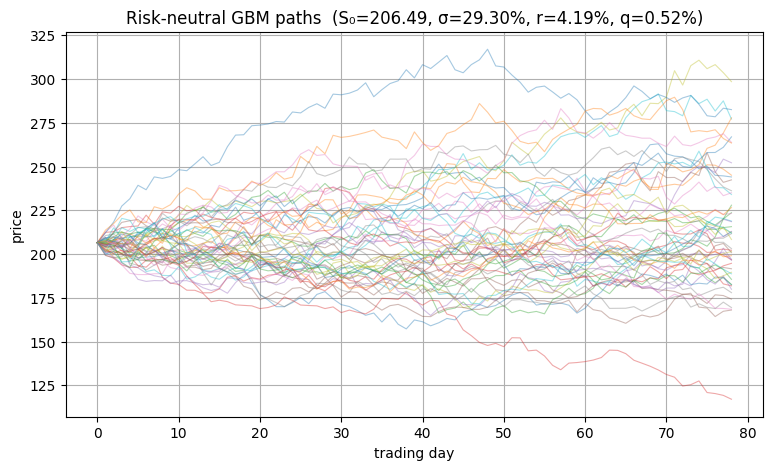
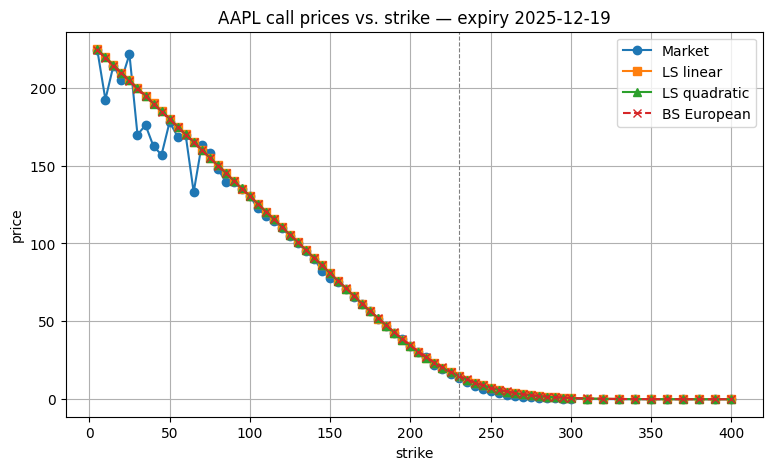

This project implements the Longstaff–Schwartz method to estimate the price of American stock options. An American option lets you buy a share at a fixed strike price any time up to expiry, so its value depends both on when it’s optimal to exercise and on the range of possible future stock prices.

We begin by simulating a large number of possible future price paths under the risk-neutral measure. Each day’s log-return is modeled as a fixed drift (the risk-free rate minus the dividend yield) plus a random shock drawn from a normal distribution. To reduce Monte-Carlo noise we use antithetic sampling: for every vector of random shocks we also simulate with its exact negative. Pairing each path with its mirror leaves the expected payoff unchanged while cutting variance.

Once all paths are generated up to expiry, we know each path’s final payoff (zero if out of the money, or the stock price minus strike if in the money). To decide on earlier exercise we work backwards. On each day (t), for every path that is in the money, we already know the path’s optimal cash-flow on day (t+1) (because the backward routine has computed it). We discount that known cash-flow back to day (t) to get the “hold” payoff for each path. We then run an ordinary least-squares regression of those discounted payoffs (the dependent variable) against simple functions of the current stock price (the independent variables)—in the linear version a constant plus the price, and in the quadratic version an added price-squared term. That regression curve gives our smooth estimate of the expected value of holding one more day. For each path we compare that continuation estimate to the immediate exercise payoff (stock price minus strike) and pick whichever is larger. If the exercise payoff wins, we record that cash flow and set all later cash flows on that path to zero (so each path pays only once). Repeating this regression-and-compare step at every prior date builds out the full optimal exercise rule and yields the option’s estimated value at time zero.

All model inputs (today’s spot price, forward dividend yield, three-month Treasury rate, and at-the-money implied volatility) are fetched automatically from Yahoo Finance so that no parameter is hard-coded. When discounting the chosen cash flow we apply continuous compounding per calendar day (so weekends and holidays still earn interest). After averaging the present-values across all paths to get our Monte-Carlo price, we compute the sample standard deviation over the square root of the number of paths to report a 95 % confidence interval. Finally, the script prints our price with its confidence band next to the actual market quote for the ATM option, then redraws the full “smile” of model versus market prices across all strikes. Example plots of the stock price simulation and of predicted versus actual option prices follow:

Dependencies: yfinance, pandas_market_calendars, matplotlib, numpy, math, warnings
Running the code: python American-Option-Pricing.py
